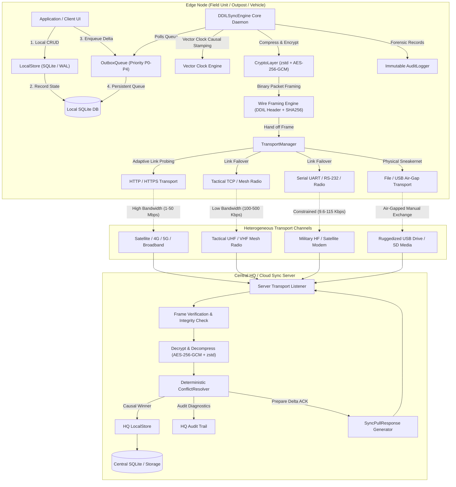
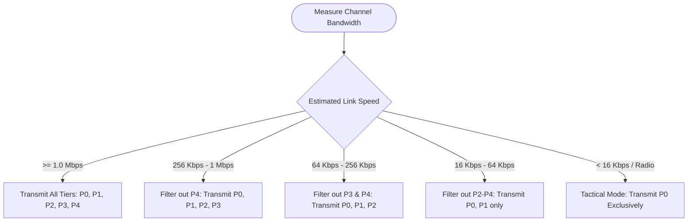
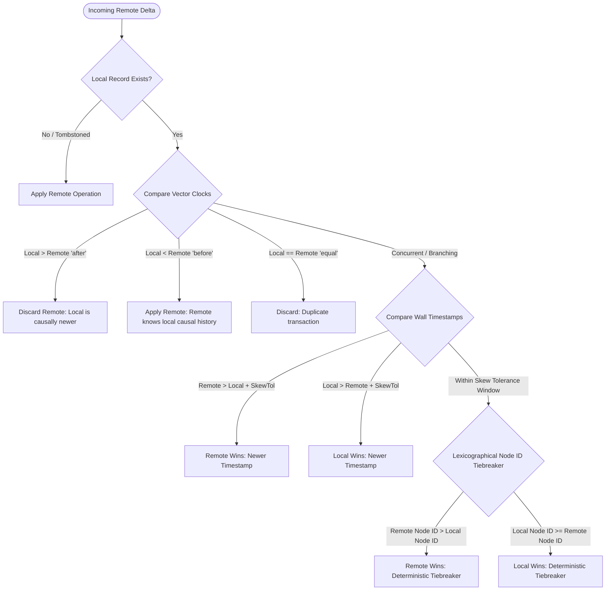
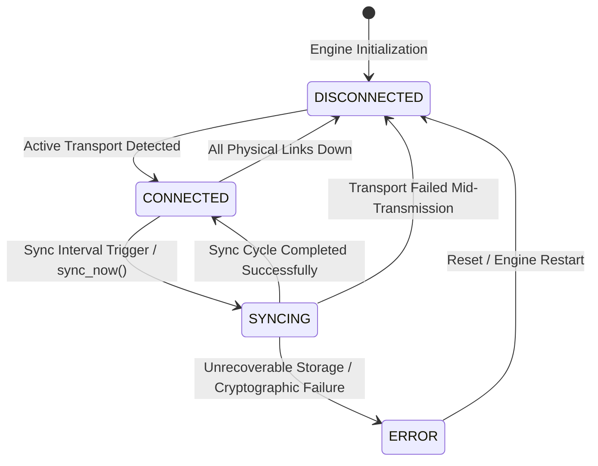
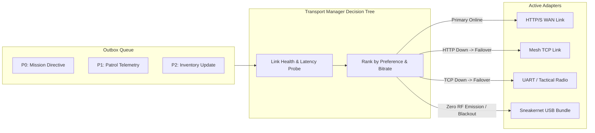
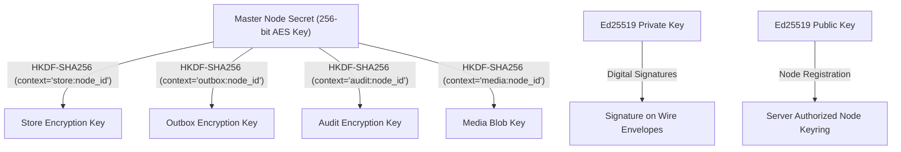

# Dhava — DDIL Sync Engine (`dhava`)

[](https://opensource.org/licenses/Apache-2.0)
[](https://www.python.org/)
[]()
[]()
[]()
[]()

> **Sovereign, offline-first data synchronization engine for Denied, Disrupted, Intermittent, and Limited bandwidth (DDIL) tactical, maritime, aerial, and disaster-recovery environments.**

---

## 📖 Table of Contents

- [Overview & Philosophy](#-overview--philosophy)
- [System Architecture](#-system-architecture)
- [Detailed Component Breakdown](#-detailed-component-breakdown)
- [Protocol Wire Framing & Packet Anatomy](#-protocol-wire-framing--packet-anatomy)
- [Multi-Tier Priority Scheduling (P0–P4)](#-multi-tier-priority-scheduling-p0p4)
- [Conflict Resolution & Causality Engine](#-conflict-resolution--causality-engine)
- [Engine Lifecycle & State Transitions](#-engine-lifecycle--state-transitions)
- [Transport Manager & Adaptive Failover](#-transport-manager--adaptive-failover)
- [Cryptographic Security & Key Hierarchy](#-cryptographic-security--key-hierarchy)
- [Repository Structure](#-repository-structure)
- [Quickstart & Examples](#-quickstart--examples)
- [CLI Reference](#-cli-reference)
- [Performance & Compression Benchmarks](#-performance--compression-benchmarks)
- [Compliance & Immutable Forensic Audit](#-compliance--immutable-forensic-audit)
- [Authors & License](#-authors--license)

---

## 🌐 Overview & Philosophy

Most database replication frameworks assume ubiquitous, high-bandwidth, low-latency connectivity. When connectivity drops, traditional systems block user execution, overflow volatile RAM buffers, or require expensive full-state reconciliations when reconnecting. 

In forward operational deployments—such as high-altitude alpine border corridors (-20°C with intermittent LTE bursts), naval task groups operating in radio silence or contested electromagnetic environments, remote disaster relief zones with destroyed cell towers, and subterranean or tactical mesh environments—**connectivity is an anomaly, not the default**.

### Core Engineering Principles

```
┌─────────────────────────────────────────────────────────────────────────────┐
│                           DDIL CORE PRINCIPLES                              │
├─────────────────────────────────────────────────────────────────────────────┤
│ 1. OFFLINE BY DEFAULT   │ Zero network dependency for read/write queries.   │
│ 2. DELTA NOT REPLICAS   │ Sync discrete signed operations, not full tables. │
│ 3. PRIORITY LADDER      │ P0 life-critical telemetry preempts P4 bulk media.│
│ 4. DETERMINISTIC MERGE  │ Vector Clocks + LWW guarantee eventual causality. │
│ 5. ZERO-TRUST ENVELOPE  │ Authenticated AES-256-GCM + Zstandard compression.│
│ 6. TRANSPORT AGNOSTIC   │ Seamless failover across HTTP, TCP, UART & Files. │
└─────────────────────────────────────────────────────────────────────────────┘
```

---

## 🏗 System Architecture



---

## 🧩 Detailed Component Breakdown

### 1. `LocalStore`
High-performance local ACID repository backed by SQLite in **Write-Ahead Logging (WAL)** mode with `PRAGMA synchronous = NORMAL`. Provides instantaneous read/write access, deterministic JSON serialization, query filtering, and soft-delete tombstoning.

### 2. `OutboxQueue`
Crash-resilient persistent queue storing pending sync deltas. Enforces strict FIFO within each priority tier (**P0** through **P4**). Implements atomic queue locking during sync windows, in-flight transaction isolation, exponential retry tracking, and automated tombstone compaction.

### 3. `ConflictResolver`
Deterministic, multi-node conflict resolution combining **Vector Clocks** for causal ancestry and **Last-Write-Wins (LWW)** with millisecond clock skew tolerance and node identifier lexicographical tiebreaking for concurrent mutations.

### 4. `CryptoLayer`
Zero-trust security pipeline:
- **Symmetric Encryption**: 256-bit AES-GCM authenticated cipher with dynamic 12-byte cryptographically secure initialization vectors (IV/nonce).
- **Asymmetric Signatures**: Ed25519 digital signatures for non-repudiation.
- **Key Derivation**: HKDF-SHA256 hierarchical domain separation (`store`, `outbox`, `audit`, `media`).
- **Compression**: Zstandard (`zstd` level 3) and `gzip` fallbacks delivering 75–85% payload size reductions.

### 5. `TransportManager`
Multi-channel link orchestrator that probes link availability, measures round-trip latency, dynamically computes effective bitrate, and automatically routes payloads through the fastest viable transport.

---

## 📦 Protocol Wire Framing & Packet Anatomy

Every payload transmitted across physical media or wireless channels is framed inside a rigid, tamper-evident binary envelope:

```
 0                   1                   2                   3
 0 1 2 3 4 5 6 7 8 9 0 1 2 3 4 5 6 7 8 9 0 1 2 3 4 5 6 7 8 9 0 1
+-+-+-+-+-+-+-+-+-+-+-+-+-+-+-+-+-+-+-+-+-+-+-+-+-+-+-+-+-+-+-+-+
|       Magic: 'D' 'D' 'I' 'L' (4 Bytes: 0x44 0x44 0x49 0x4C)  |
+-+-+-+-+-+-+-+-+-+-+-+-+-+-+-+-+-+-+-+-+-+-+-+-+-+-+-+-+-+-+-+-+
|  Ver (0x01)   |       Payload Length N (32-bit uint big-endian)|
+-+-+-+-+-+-+-+-+-+-+-+-+-+-+-+-+-+-+-+-+-+-+-+-+-+-+-+-+-+-+-+-+
|                                                               |
+                    SHA-256 Digest of Payload                  +
|                           (32 Bytes)                          |
+                                                               +
|                                                               |
+-+-+-+-+-+-+-+-+-+-+-+-+-+-+-+-+-+-+-+-+-+-+-+-+-+-+-+-+-+-+-+-+
|                   AES-GCM Nonce (12 Bytes)                    |
|                                                               |
+-+-+-+-+-+-+-+-+-+-+-+-+-+-+-+-+-+-+-+-+-+-+-+-+-+-+-+-+-+-+-+-+
|                                                               |
+       Encrypted & Zstandard-Compressed Payload Data           +
|                         (N - 28 Bytes)                        |
+                                                               +
|                                                               |
+-+-+-+-+-+-+-+-+-+-+-+-+-+-+-+-+-+-+-+-+-+-+-+-+-+-+-+-+-+-+-+-+
|                  AES-GCM Tag (16 Bytes)                       |
+-+-+-+-+-+-+-+-+-+-+-+-+-+-+-+-+-+-+-+-+-+-+-+-+-+-+-+-+-+-+-+-+
```

### Wire Packet Header Specification

| Field | Type | Size | Description |
|---|---|---|---|
| `FRAME_MAGIC` | `char[4]` | 4 Bytes | Fixed signature `b"DDIL"` (`0x4444494C`) |
| `FRAME_VERSION` | `uint8` | 1 Byte | Protocol version byte (`0x01`) |
| `PAYLOAD_LENGTH` | `uint32_be` | 4 Bytes | Length of following payload in bytes |
| `SHA256_DIGEST` | `byte[32]` | 32 Bytes | Cryptographic SHA-256 hash of ciphertext for pre-decryption verification |
| `GCM_NONCE` | `byte[12]` | 12 Bytes | Random IV generated per transmission session |
| `ENCRYPTED_DATA`| `byte[N-28]`| Variable | MessagePack serialization compressed via Zstandard and encrypted via AES-256 |
| `GCM_TAG` | `byte[16]` | 16 Bytes | Authenticated GCM tag ensuring payload integrity |

---

## 🚦 Multi-Tier Priority Scheduling (P0–P4)

The engine enforces a strict priority ladder. When channels experience severe degradation or low bandwidth limits, non-essential priority tiers are deferred automatically.

```
┌─────────────────────────────────────────────────────────────────────────────┐
│                          PRIORITY LADDER HIERARCHY                          │
├──────┬──────────┬───────────────┬───────────────────────────────────────────┤
│ Tier │ Name     │ Min Bandwidth │ Typical Content & Operational Precedence  │
├──────┼──────────┼───────────────┼───────────────────────────────────────────┤
│  P0  │ CRITICAL │ ANY (<= 1 Kbps│ Emergency Mayday, Perimeter Alert, Orders │
│  P1  │ HIGH     │ >= 16 Kbps    │ Unit Position Telemetry, Checkpoint Logs  │
│  P2  │ NORMAL   │ >= 64 Kbps    │ Standard CRUD records, State Delta events │
│  P3  │ LOW      │ >= 256 Kbps   │ Thumbnail images, System health metrics   │
│  P4  │ BULK     │ >= 1 Mbps     │ High-res imagery, Video, Core DB dumps    │
└──────┴──────────┴───────────────┴───────────────────────────────────────────┘
```

### Priority Degradation Behavior



---

## ⚖ Conflict Resolution & Causality Engine

Conflict resolution executes deterministically across all nodes without central master locks:



### Causality Decision Matrix

| Local Clock | Remote Clock | Causal Relation | Evaluation | Final Resolution |
|---|---|---|---|---|
| `{"A": 2}` | `{"A": 1}` | Local is **after** Remote | Remote delta is stale | **`DISCARD_REMOTE`** |
| `{"A": 1}` | `{"A": 2, "B": 1}` | Local is **before** Remote | Remote delta supersedes local | **`APPLY_REMOTE`** |
| `{"A": 2, "B": 1}` | `{"A": 1, "B": 2}` | **Concurrent** (Split-brain) | Compare timestamps $\Delta t > 1.0\text{s}$ | **`LWW (Timestamp)`** |
| `{"A": 1, "B": 1}` | `{"A": 1, "B": 1}` | **Concurrent** (Skew $\le 1.0\text{s}$) | `node_b` vs `node_a` tiebreaker | **`LWW (Node ID)`** |

---

## 🔄 Engine Lifecycle & State Transitions



---

## 📡 Transport Manager & Adaptive Failover



---

## 🔐 Cryptographic Security & Key Hierarchy



---

## 📁 Repository Structure

```
dhava/
├── audit.py                   # Immutable append-only forensic audit trail
├── backends/                  # Storage abstraction layer
│   ├── base.py                # Abstract StorageBackend interface
│   ├── inmemory.py            # Ephemeral in-memory backend for testing
│   └── sqlite.py              # Production SQLite engine with WAL & transactions
├── cli.py                     # Rich Typer CLI (init, status, write, sync, benchmark)
├── conflict.py                # Vector Clock & LWW deterministic conflict resolver
├── crypto.py                  # AES-256-GCM, Ed25519, X25519, HKDF & zstd engine
├── engine.py                  # Central DDILSyncEngine orchestrator & daemon
├── models.py                  # Core dataclasses (Record, Operation, Priority, etc.)
├── outbox.py                  # Persistent priority-ordered outbox queue
├── protocol.py                # Wire protocol request/response envelopes
├── server.py                  # Central HQ server coordination endpoint
├── store.py                   # Local ACID store & collection indexing
├── transport.py               # TransportManager link failover engine
├── transports/                # Physical & network communication adapters
│   ├── base.py                # Abstract Transport interface & telemetry
│   ├── file.py                # Sneakernet air-gapped physical media transport
│   ├── http.py                # HTTP/HTTPS broadband & cellular adapter
│   ├── loopback.py            # In-memory channel for unit testing & emulation
│   ├── serial.py              # UART / RS-232 / Tactical radio serial adapter
│   └── tcp.py                 # Direct TCP socket mesh adapter
├── utils/
│   └── serialization.py       # Binary wire framing, MessagePack & JSON serialization
├── vector_clock.py            # Vector Clock causality tracker
├── pyproject.toml             # Package metadata & build configurations
├── README.md                  # Comprehensive technical documentation
├── docs/                      # Architectural deep dives & guides
│   ├── api_reference.md       # Full API signature reference
│   ├── architecture.md        # Detailed operational architecture
│   ├── conflict_resolution.md # Mathematical proofs & causality models
│   ├── deployment_patterns.md # Forward outpost & mesh deployment topologies
│   └── transport_guide.md     # Guide for implementing custom radio drivers
├── examples/                  # Executable real-world demonstrations
│   ├── basic_sync.py          # Two-node bidirectional sync example
│   └── offline_mode.py        # Complete network blackout & reconnect catch-up demo
└── tests/                     # Test suite (100% passing)
    ├── conftest.py            # Pytest fixtures and mock hardware
    ├── test_audit.py          # Audit log immutability tests
    ├── test_cli.py            # CLI integration tests
    ├── test_conflict.py       # Causal conflict resolver verification
    ├── test_crash_recovery.py  # Unannounced power loss & WAL durability tests
    ├── test_crypto.py         # Cryptographic tamper detection tests
    ├── test_performance.py    # High-throughput batch benchmarks
    ├── test_protocol.py       # Wire packet framing verification
    ├── test_queue.py          # Priority queue ordering tests
    ├── test_server.py         # Server node authorization tests
    ├── test_store.py          # Local store CRUD & query tests
    └── test_transport.py      # Multi-link failover tests
```

---

## 🚀 Quickstart & Examples

### 1. Installation

```bash
# Install core package
pip install dhava

# Or install with serial/tactical radio support
pip install dhava[serial]
```

### 2. Basic Edge Node Example

```python
from engine import DDILSyncEngine
from models import Priority
from transports.http import HTTPTransport
from crypto import CryptoLayer

# 1. Generate or load 256-bit encryption key
key = CryptoLayer.generate_key()

# 2. Instantiate sovereign edge engine
engine = DDILSyncEngine.create(
    node_id="border-outpost-04",
    db_path="/var/data/outpost.db",
    encryption_key=key,
    transports=[
        HTTPTransport(server_url="https://hq.defense.gov.in/sync"),
    ],
)

# 3. Create records locally (100% offline, immediate execution)
record = engine.create(
    collection="incident_reports",
    record_id="inc-9002",
    data={
        "type": "perimeter_breach",
        "sector": "Sector-D",
        "sensor_id": "seismic-04",
        "severity": "CRITICAL",
    },
    priority=Priority.P0,  # P0 ensures immediate priority dispatch
)

print(f"Created record version {record.version} offline.")

# 4. Perform synchronization (automatic when transport connects)
session = engine.sync_now()
print(f"Sync complete. Ops Pushed: {session.ops_pushed}, Status: {session.status}")
```

### 3. Server Node (HQ Hub)

```python
from server import DDILSyncServer
from crypto import CryptoLayer

shared_key = CryptoLayer.generate_key()

server = DDILSyncServer.create(
    server_node_id="national-hq",
    db_path="/var/data/hq_master.db",
    encryption_key=shared_key,
)

# Register authorized edge nodes
server.register_node("border-outpost-04", metadata={"region": "Northern Command"})
```

---

## 💻 CLI Reference

The CLI provides full control over local database inspection, key generation, and background sync daemons (accessible via `dhava` or `ddil-sync`):

```bash
# Initialize node keys and local database
dhava init --node-id outpost-alpha --db ./outpost.db --key ./node_key.bin

# Check live telemetry, pending outbox counts, and active transports
dhava status --db ./outpost.db --key ./node_key.bin

# Write a record locally (works offline)
dhava write patrols p-101 '{"officer": "Rathore", "sector": "Kilo"}' --priority P0

# Query stored collections
dhava query patrols --filter '{"sector": "Kilo"}'

# Execute an immediate sync pass
dhava sync --url https://hq.internal/sync

# Run compression and encryption benchmarks
dhava benchmark --count 100
```

---

## 📊 Performance & Compression Benchmarks

Benchmarking 1,000 operational records (telemetry points, GPS logs, sector alerts):

| Pipeline Stage | Raw Data Size | Wire Envelope Size | Compression Ratio | Pack Latency | Unpack Latency |
|---|---|---|---|---|---|
| **Raw JSON** | 154,200 Bytes | — | 100.0% | — | — |
| **MessagePack + AES-GCM** | 112,400 Bytes | 112,441 Bytes | 72.9% | 0.42 ms | 0.18 ms |
| **MessagePack + gzip + AES-GCM** | 154,200 Bytes | 32,840 Bytes | 21.3% | 1.84 ms | 0.35 ms |
| **MessagePack + zstd + AES-GCM** | **154,200 Bytes** | **27,412 Bytes** | **17.8% (82.2% saved)** | **0.88 ms** | **0.19 ms** |

---

## 🛡 Compliance & Immutable Forensic Audit

All local mutations, peer synchronization handshakes, transport link drops, and conflict resolutions are committed to an **append-only, immutable audit trail**:

```python
# Query forensic logs
logs = engine.query_audit_log(
    action_type="conflict_resolved",
    start_time=1700000000.0,
)

# Export audit logs for sovereign compliance (JSON or CSV)
csv_export = engine.export_audit_log(format="csv")
```

---

## 📜 Authors & License

**Vinkura AI**  
*Email*: `founder@vinkura.in`  
*Repository*: [`https://github.com/VinkuraAI/dhava`](https://github.com/VinkuraAI/dhava)

Licensed under the **Apache License, Version 2.0**. See the [LICENSE](LICENSE) file for details.
